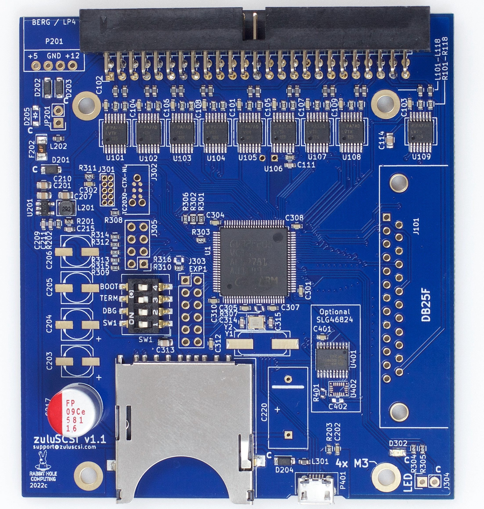

ZuluSCSI is a SCSI computer storage emulation platform, which speaks both SCSI-1 and SCSI-2. It uses file-based SCSI HDD & CD-ROM images, similar to RaSCSI and BlueSCSI. It represents a fusion of firmware and concepts from both SCSI2SD V6 and BlueSCSI. Hard drive and CD-ROM drive images are stored on a standard FAT32 or exFAT-formatted SD card.

## Features

* Emulates up to 7 SCSI devices simultaneously, including CD-ROM
* Speaks both SCSI-1 and SCSI-2
* SCSI Termination is DIP-switch controlled
* Firmware upgrade simplicity; As easy as placing a file on the SD card.
* Highly configurable using a text-based ini file, ZuluSCSI.ini
* External LED pin header for attaching remote LEDs.
* Designed to be powered via SCSI termination power, when provided by the host
* Optional DB25 pin header for direct installation of an external SCSI connector, in addition to the Single-Ended 50 pin IDC connector
* Identical dimensions and mounting holes as that of SCSI2SD V5.1, V5.2, and V6, making it compatible with many existing SCSI2SD-specific mounting solutions
* 74LVTH125 SCSI bus transceivers, as used in SCSI2SD V5 and SCSI2SD V6 Rev F

#### Firmware structure

* SCSI command implementations are from SCSI2SD
* SCSI physical layer code is mostly custom, with some inspiration from BlueSCSI
* Image file access is derived from BlueSCSI

#### Major changes from BlueSCSI and SCSI2SD

* Separation of platform-specific functionality to separate directory to ease porting
* Ported to the GigaDevice GD32F205 ARM Cortex processor
* Removal of Arduino core dependency
* Buffered log functions
* Simultaneous transfer between SD card and SCSI bus for improved performance

### Origins and License

#### Firmware origins

The ZuluSCSI firmware is derived from two sources, both under GPL 3 license:

* [SCSI2SD V6](http://www.codesrc.com/gitweb/index.cgi?p=SCSI2SD-V6.git;a=summary)
* [BlueSCSI](https://github.com/erichelgeson/BlueSCSI), which in turn is derived from [ArdSCSIno-stm32](https://github.com/ztto/ArdSCSino-stm32).

#### Hardware 
The ZuluSCSI V1.0 and V1.1 hardware designs are derived from the SCSI2SD V5.1 hardware design.
