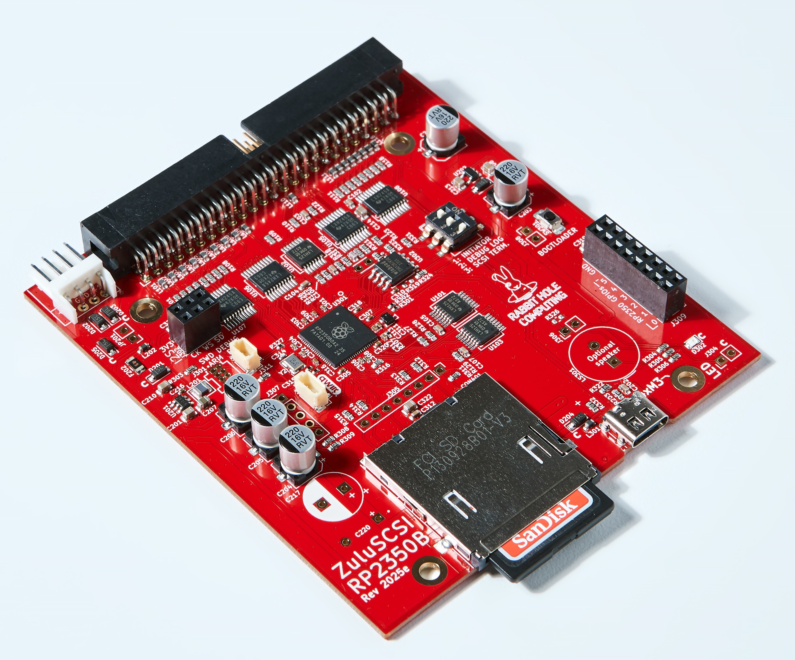

ZuluSCSI® is a SCSI computer storage emulation platform, which speaks both SCSI-1 and SCSI-2. It uses file-based SCSI HDD & CD-ROM images. New for 2025, **ZuluSCSI Blaster** is Powered by Raspberry Pi, and leverages the new RP2350B, which includes additional I/O capabilities, beyond what was possible with the previous generations of our products. Hard drive and CD-ROM drive images are stored on a standard FAT32 or exFAT-formatted SD card, and are exposed as block devices to the operating system.

## Features of ZuluSCSI Blaster

* Based on the 80-pin Raspberry Pi RP2350B microcontroller
* Speaks both SCSI-1 and SCSI-2, including 20MB/sec Fast SCSI and narrow **Ultra SCSI**
* Up to **18 megabytes/second** read speeds, 11MB/sec write speeds (on ZuluSCSI Blaster-based models)
* Support for ROM drives of up to 15.8 **megabytes** in size. That's more than twelve 1.44MB floppy disks.
* Emulates up to 7 SCSI devices simultaneously, including CD-ROM, Magneto Optical, removable (SyQuest/Jaz-style), and SCSI floppy device types
* Optional [DaynaPORT SCSI Ethernet Wi-Fi emulation](https://github.com/ZuluSCSI/ZuluSCSI-firmware/wiki/WiFi-DaynaPORT-Ethernet-emulation) provided by plug-in RM2 radio module
* Optional Red Book CD Audio emulation (using bin/cue files), via plug-in DAC board
* Support for [SCSI Initiator Mode](https://github.com/ZuluSCSI/ZuluSCSI-firmware/wiki/ZuluSCSI-Initiator-Mode), which allows the ZuluSCSI Blaster to access the contents of SCSI drives via [USB Mass Storage](https://github.com/ZuluSCSI/ZuluSCSI-firmware/wiki/USB-Mass-Storage) over USB at USB 1.1 speeds
* Firmware upgrade simplicity; As easy as placing a file on the SD card
* Highly configurable using a text-based ini file, ZuluSCSI.ini
* External activity LED pin header for attaching remote activity LED
* Designed to be powered via SCSI termination power when provided by the host
* SCSI Termination is DIP-switch controlled

#### Firmware origins & license

The open source [ZuluSCSI® firmware](https://github.com/zuluscsi/zuluscsi-firmware), licensed under the [GPLv3](https://www.gnu.org/licenses/gpl-3.0.en.html) is derived from two sources, both under GPL 3 license:

* [SCSI2SD V6](http://www.codesrc.com/gitweb/index.cgi?p=SCSI2SD-V6.git;a=summary)
* [BlueSCSI V1](https://github.com/erichelgeson/BlueSCSI), which in turn is derived from [ArdSCSIno-stm32](https://github.com/ztto/ArdSCSino-stm32).
