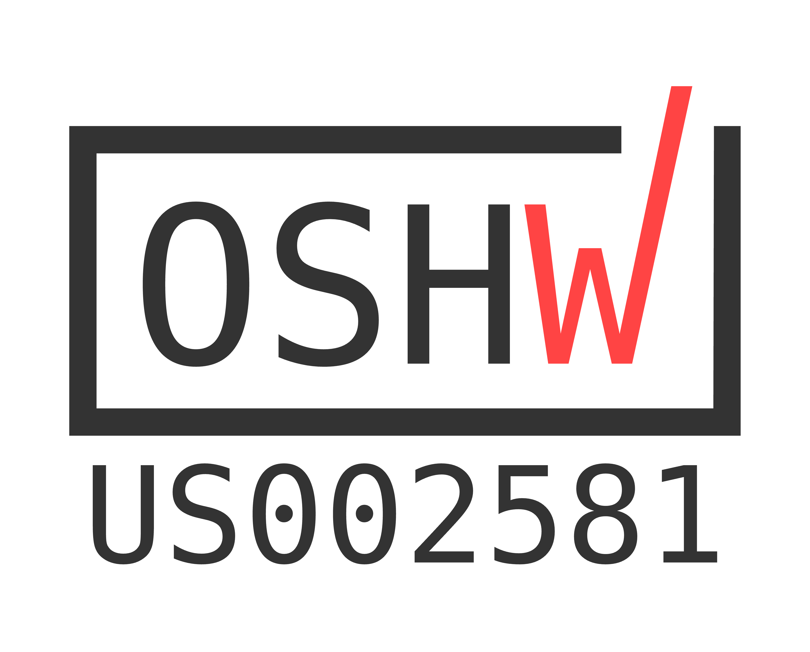

# ZuluSCSI Pico Open Source Hardware Design

Open Source hardware</a> by the Open Source Hardware Association.

**October 10th, 2023** - Rabbit Hole Computing™, creators of the RP2040-based ZuluSCSI family of SCSI drive emulation devices, has released the [ZuluSCSI™ Pico OSHW](https://github.com/ZuluSCSI/ZuluSCSI-Pico-OSHW) board layout and design files under the [CERN OHL-S 2.0](https://spdx.org/licenses/CERN-OHL-S-2.0.html) (strongly reciprocal variant) license.

We welcome contributions and questions. Feel free to ask questions in the [Discussions section of the repository at https://github.com/ZuluSCSI/ZuluSCSI-Pico-OSHW/discussions](https://github.com/ZuluSCSI/ZuluSCSI-Pico-OSHW/discussions) 

 

